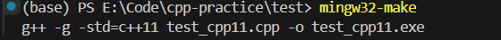
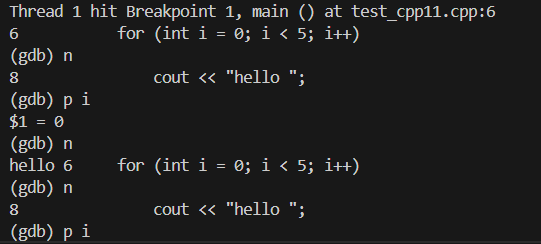

# Day 01 学习成果汇报

## 1. 核心环境核查

- **操作系统：** Windows 11
- **编译器：** MinGW-W64 GCC 8.1.0 (已验证完美支持 C++11/14 标准)
- **版本控制：** Git
- **编辑器：** VS Code

## 2. Makefile 自动化编译测试

通过严谨的 Makefile 脚本，成功实现了 C++11 代码的一键编译。

**核心编译参数：**
`g++ -g -std=c++11 test_cpp11.cpp -o test_cpp11.exe`

**编译运行截图：**

## 3. GDB 调试探究

已掌握 GDB 的核心底层指令，成功对生成的 `.exe` 文件（携带 `-g` 调试信息）进行了单步追踪和内存透视。

**掌握的核心指令集：**

- `b main`: 设置断点
- `r`: 启动调试
- `n`: 单步执行
- `p 变量名`: 打印变量值

**GDB 调试实况截图：**

## 4. 今日总结

环境配置不仅要知其然，更要知其所以然。今日已完成本地代码大本营的构建，并成功与 GitHub 远程仓库建立双向同步。
